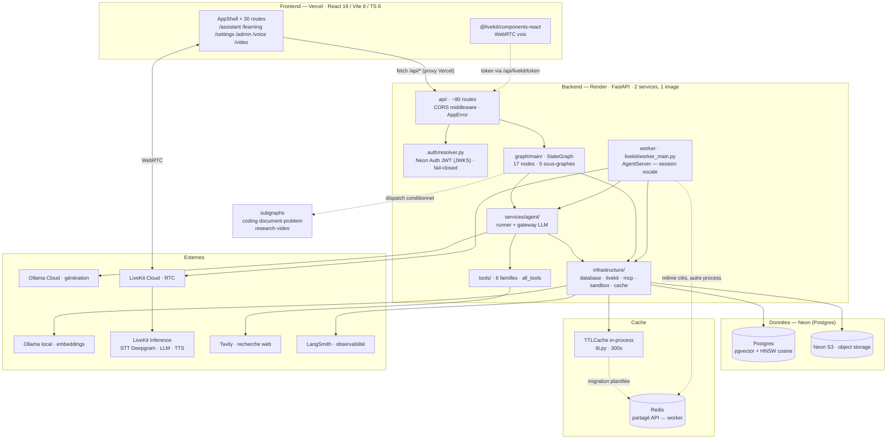
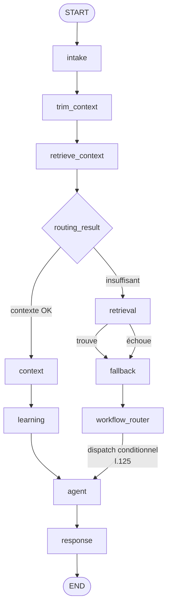

# ARCHITECTURE — Agent Tutor

> Document de référence. Décrit **l'état réel du code au commit `bba8c36`** (2026-09-29).
> Les décisions et leur justification sont dans [`DECISIONS.md`](DECISIONS.md).
> Les contrats HTTP sont dans [`API.md`](API.md). Le plan de réalisation est dans [`ROADMAP.md`](ROADMAP.md).
>
> **Convention de lecture** : `[F]` = fait vérifié dans le code · `[P]` = planifié, pas encore implémenté · `[?]` = à confirmer.

---

## 1. Le produit en une phrase

Agent IA pédagogique qui répond par **texte** (SSE) et par **voix temps réel** (WebRTC), avec **mémoire longue** par utilisateur, **RAG** sur documents, et **outils** (recherche web, exécution de code, agenda, fichiers).

## 2. Vue d'ensemble



### Le point clé de l'architecture

`backend/render.yaml` déploie **deux services depuis la même image Docker** :

| Service | Commande | Rôle |
|---|---|---|
| `agent-tutor-api` | uvicorn (défaut) | API HTTP, orchestration LangGraph, SSE |
| `agent-tutor-worker` | `python -m app.infrastructure.livekit.worker_main` | Sessions vocales LiveKit AgentServer |

Conséquence structurante : **les deux processus lisent et écrivent les mêmes tables mais ont des mémoires distinctes.** C'est ce qui rend le cache local incohérent (voir §6) et c'est ce qui justifie Redis.

## 3. Couches backend

```
backend/app/
├── main.py                  FastAPI, lifespan, 15 routers + WS
├── config.py                Toute la config, lue depuis l'env
├── api/                     Contrats HTTP — ne contient QUE de la validation/instance
│   ├── admin/               Routers réservés require_admin
│   ├── health.py            /health /ready /model-gateway /langsmith /auth
│   ├── livekit.py           token, agent start/stop, screen-share
│   └── *_schemas.py         Contrats Pydantic request/response
├── auth/resolver.py         ⭐ Seul point d'entrée d'authentification
├── graph/                   Orchestration LangGraph
│   ├── main/                Graphe principal : graph/edges/state/routing
│   ├── nodes/               17 nodes du graphe principal
│   └── subgraphs/           coding · document · problem · research · video
├── services/                Logique métier — ne connaît pas FastAPI
│   ├── agent/               runner, middleware, gateway LLM
│   ├── models/              registry (YAML) + resolver (assignations) + retry
│   ├── memory/              Profil + faits, long terme
│   ├── learning/            Profil apprenant, objectifs, moteur pédagogique
│   ├── context/             builder, router, budget, capabilities
│   ├── knowledge/           Bases de connaissances (CRUD admin)
│   ├── documents/           Ingestion + vector_store (RAG)
│   ├── storage/             object_store, calendar_events, mcp_files
│   └── activity/ evaluation/
├── repositories/            Accès données. SQL ici, PAS dans api/
├── infrastructure/
│   ├── database/            connections · schema · persistence · threads · users
│   ├── livekit/             worker vocal (12 fichiers, 1 983 lignes)
│   ├── mcp/                 registry + toolset + servers (calendar, filesystem)
│   ├── sandbox/             executor de code
│   ├── cache/ttl.py         Cache in-process
│   └── observability/
├── tools/                   Ce que le LLM peut appeler (6 familles)
│   ├── pedagogical/         ← 1 693 lignes, le plus gros fichier du projet
│   ├── coding/  memory/  learning/  search/  documents/
└── schemas/                 Contrats partagés (workflow, context)
```

### Règles de dépendance (à faire respecter)

```
api/        → services/  → repositories/  → infrastructure/database/
   ↓             ↓
auth/        infrastructure/
   ↓
graph/      → services/, tools/            (jamais l'inverse)
tools/      → services/                    (jamais api/)
```

`api/` ne doit jamais écrire de SQL. Les 13 fichiers qui le font aujourd'hui sont listés dans `ROADMAP.md` lot C4.

## 4. Graphe LangGraph

### 4.1 Flux principal



- `START → intake` : `edges.py:79`
- Chaîne de préparation du contexte : `:82-84`
- `retrieval → fallback` / `fallback → workflow_router` : `:92-93`
- `context → learning → agent → response → END` : `:95-98`
- **Dispatch conditionnel vers les sous-graphes** : `edges.py:125`

`agent` (l.73) est un **sous-graphe dynamique** : le modèle le choisit au runtime selon `workflow` et `payload`.

### 4.2 Les 5 sous-graphes

| Sous-graphe | Rôle | Fichiers spécifiques |
|---|---|---|
| `coding` | Génération et exécution de code | `nodes.py`, `state.py` |
| `document` | RAG sur documents importés | `nodes.py`, `state.py` |
| `problem` | Résolution d'exercice | + `planner` `parser` `evaluator` `artefact` `schemas` |
| `research` | Recherche web multi-étapes | + `planner` `claims` |
| `video` | Transcription et indexation vidéo | + `agent` `frames` `ingest` `metadata` `persist` `retrieval` `segment` `transcribe` `schemas` |

### 4.3 État

`CustomAgentState(MessagesState)` — `graph/main/state.py:19` :
`messages`, `user_id`, `interaction_count`, `learning_activity`, `activity_log` (réducteur `operator.add`), `code_runs`, + 7 canaux de passage du Refactor V7 (`routing_result`, `knowledge`, `web`, `fallback`, `built_context`, `learning_decision`, `agent_response`).

`MainState` — l.72 — ajoute l'état d'orchestration : `intake`, `workflow`, `workflow_result`, `workflow_hint`, `payload`, `learner_context`.

> ⚠ **`[?]` À VÉRIFIER** — Trois champs sont déclarés `_`-préfixés : `_context_block` (l.133), `_trim_needed` (l.139), `_middle_summary` (l.144). Les commentaires les décrivent comme « TRANSIENT, non persistés ». Or **en Pydantic v2 un champ dont le nom commence par `_` est un `PrivateAttr`, pas un champ du modèle** : il ne fait donc pas partie du schéma sérialisé. Le comportement voulu est probablement obtenu, mais par un mécanisme non testé et non lisible. Voir `ROADMAP.md` lot A3.

## 5. Données

### 5.1 Source unique

`[F]` **Postgres (Neon) est la seule base.** `infrastructure/database/persistence.py:33-44` lève un `RuntimeError` explicite si `DATABASE_URL` est absente. `is_postgres_persistence()` (l.317) retourne toujours `True`.

Décision prise le 2026-09-29, consignée dans `DECISIONS.md` ADR-002.

### 5.2 Tables

| Table | Contenu | Accès |
|---|---|---|
| `users` | Identité interne + `clerk_user_id` (identité externe Neon) | `infrastructure/database/users.py` |
| `threads` | Conversations | `infrastructure/database/threads.py` |
| `agent_events` | Journal d'événements (observabilité, SSE) | `logging/events.py` |
| `knowledge_files` / `knowledge_sections` | Bases de connaissances, sections vectorisées | `services/knowledge/store.py` |
| `knowledge_bases` / `knowledge_access_rules` | Règles d'accès par knowledge base | `services/knowledge/resolver.py` |
| `subject_definitions` | Définitions de matières (source du registre) | `api/admin/subjects.py` |
| `object_storage` | Métadonnées d'objets (contenu en Neon S3) | `services/storage/object_store.py` |
| `videos` / `video_segments` | Vidéos et segments vectorisés | `graph/subgraphs/video/` |
| `calendar_events` / `mcp_files` / `mcp_file_versions` | MCP | `services/storage/` |

### 5.3 RAG

`services/documents/vector_store.py` :
- pgvector, colonne `vector(dim)`, index HNSW `vector_cosine_ops`, seuil cosine `0.6`
- Dimension lue depuis `app/embeddings.yaml` (actif : `ollama-0-6b`, `qwen3-embedding:0.6b`, dim 1024)
- Plafond pgvector : 16 000 dimensions (`_PGVECTOR_MAX_DIM`, l.82)
- Toute erreur de store remonte `RagStoreError` — le routing retombe alors sur la recherche lexicale (fail-safe)

### 5.4 Migrations

`[F]` **Aucun système de migration.** `infrastructure/database/schema.py` utilise `CREATE TABLE IF NOT EXISTS` + `ALTER TABLE ADD COLUMN` inline, exécuté au startup par `init_schema()` (l.311). Pas de version, pas de rollback possible.

`[P]` Alembic est le remplacement retenu — voir `DECISIONS.md` ADR-005 et `ROADMAP.md` lot C1.

## 6. Cache

### 6.1 État actuel — 4 caches in-process

| Cache | Emplacement | TTL | Partagé API ↔ worker |
|---|---|---|---|
| Mémoire utilisateur (profil + faits) | `services/memory/memory.py:50` | 300 s | ❌ |
| Registre des matières | `subjects/registry.py` | illimité + invalidation manuelle | ❌ |
| Engine knowledge (lru) | `services/knowledge/store.py:44` | illimité | ❌ |
| Engines DB (singletons) | `infrastructure/database/connections.py:198,208` | illimité | ❌ par construction |

### 6.2 Le défaut que Redis corrige

`ttl.py:11-14` justifie l'absence de Redis par « un seul process ». **Cette prémisse est fausse** : `render.yaml` déploie deux services.

```
1. L'utilisateur modifie son profil depuis l'UI
2. → agent-tutor-api      : invalidate_memory_cache(user_id)      ✅
3. L'utilisateur démarre une session vocale
4. → agent-tutor-worker  : read_profile()                          ❌
   Le cache du worker est encore peuplé → renvoie l'ancien profil
   pendant 5 minutes. Aucun log, aucune erreur.
```

Ce défaut est **invisible en développement local** (un seul process), donc il ne sera pas trouvé par les tests.

### 6.3 Cible

`[P]` Store partagé entre les deux services. Les clés déjà nommées dans le code (`mem:{user_id}:profile`, `mem:{user_id}:facts`) sont conservées telles quelles.

**Ce qui ne sera jamais mis en cache** (décision déjà écrite dans `memory.py:48-49`, à respecter) : les résultats LLM, et les états de thread — le checkpointer Postgres est la seule source de vérité.

## 7. Sécurité

### 7.1 Authentification

`auth/resolver.py` est le **seul** point d'entrée.

| Mode | Comportement |
|---|---|
| `AUTH_MODE=neon` (prod) | Bearer JWT → `PyJWKClient` (JWKS) → claim `sub` → `users.clerk_user_id` → `user_id` interne. `verify_neon_token` l.87, `resolve_internal_user` l.129 avec provisionnement automatique au premier login (l.140-172) |
| `AUTH_MODE=dev` | `Bearer dev:<name>` (l.202) |
| **Autre** | **HTTP 503 — jamais `None`** (l.269-282) |

Le fail-closed est la bonne décision : un `AUTH_MODE` mal configuré casse l'API visiblement au lieu d'ouvrir un accès.

`get_current_user` (l.286) · `require_admin` (l.294) · rôle admin via `clerk_user_id ∈ ADMIN_CLERK_IDS`.

### 7.2 Surface d'attaque connue

| Point | État | Renvoi |
|---|---|---|
| CORS `/api/*` dans `vercel.json` | `Access-Control-Allow-Origin: *` — court-circuite `ALLOWED_ORIGINS` du backend | `ROADMAP.md` lot B1 |
| `ALLOWED_ORIGINS` en prod | `render.yaml` le documente obligatoire mais la valeur reste `http://localhost:5173` | `ROADMAP.md` lot B2 |
| Rate limiting | Aucun sur `/api/chat` (coût LLM) ni `/api/livekit/token` | `ROADMAP.md` lot B4 |
| Fichiers non commités | `proj-neon.json`, `svc_raw.json` (dumps d'API) | `ROADMAP.md` lot B3 |

## 8. Frontend

Vercel (région `fra1`), build Vite, sortie `frontend/dist`. Le proxy `/api/:path*` → `agent-tutor-api.onrender.com` fait que le navigateur ne voit jamais le backend directement.

### Points d'attention

- **Trois dossiers UI parallèles** : `src/assistant-ui/`, `src/components/assistant-ui/`, `src/components/agents-ui/`. Aucun n'est un alias de l'autre.
- **Fichiers WIP que le projet déclare non committables** : `components/assistant-ui/elements/thread.aui.tsx`, `pages/AssistantPage.tsx`, `hooks/use-composer-mentions.ts` (listés dans `MEMORY.md`).
- **Routes dupliquées** : `/chat` redirige vers `/assistant` ; `ProfilePage` existe à la racine alors que `/settings/profile` existe aussi.
- `App.tsx` déclare un **second `<Routes>` hors AppShell** pour les routes publiques/auth — intentionnel, mais à garder en tête.

## 9. Déploiement

| Cible | Rôle |
|---|---|
| Vercel | Front statique + proxy `/api` |
| Render `agent-tutor-api` | API HTTP, healthcheck `/api/health` |
| Render `agent-tutor-worker` | Worker vocal, healthcheck `/healthz` (200 seulement si enregistré auprès de LiveKit) |

Les credentials LiveKit **doivent être partagés** entre l'API et le worker : sinon le dispatch créé n'est jamais réclamé.

`render.yaml` se déclare « source de vérité **en plus** du dashboard, le dashboard gagne ». Toute modification de secret se fait donc dans les deux endroits, ou dans le dashboard seul.

## 10. Intégrité et livraison continue

`[F]` `.github/workflows/ci.yml` exécute :
- **backend** : `compileall`, 5 smoke imports, `from app.tools import all_tools`, puis `pytest` — **`continue-on-error: true`**
- **frontend** : `npm ci`, `npm run lint` — **`continue-on-error: true`**, puis `npm run build`

Seuls `compileall` et le build Vite bloquent une livraison. Tests et lint sont informatifs.

Ce choix est assumé : l'en-tête du fichier rappelle que « trois poussées consécutives ont cassé la prod à cause d'imports morts et d'un package PyPI inexistant ». La CI a été affaiblie en réaction à des échecs d'infrastructure, pas par désaccord avec le principe.

`[P]` Rétablir le blocage progressivement — `ROADMAP.md` lot B5.

## 11. Conventions

| Sujet | Convention |
|---|---|
| Erreurs | `AppError` avec `status_code` par taxon. Le `except Exception` est toléré aux frontières (nodes LangGraph, tool handlers) et documenté par `# noqa: BLE001` quand il est volontaire |
| Nommage | `snake_case` fichiers et fonctions · `PascalCase` classes et composants React |
| Contrats | Pydantic v2, un schéma par route, dans `api/*_schemas.py` |
| Configuration | **Uniquement** via `config.py` → env. Aucun `os.environ` dispersé |
| Secrets | Jamais dans le dépôt. `.env` et `.env.local` sont gitignorés |
| SQL | Uniquement dans `repositories/` et `infrastructure/database/` |
| Outils LLM | Registre unique `app/tools/__init__.py` → `all_tools`, vérifié par la CI |
