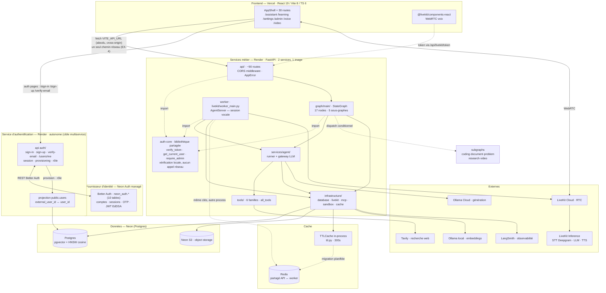

# ARCHITECTURE — Agent Tutor

> Document de référence. Décrit **l'état réel du code au commit `bba8c36`** (2026-09-29).
> Les décisions et leur justification sont dans [`DECISIONS.md`](DECISIONS.md).
> Les contrats HTTP sont dans [`API.md`](API.md). Le plan de réalisation est dans [`ROADMAP.md`](ROADMAP.md).
>
> **Convention de lecture** : `[F]` = fait vérifié dans le code · `[P]` = planifié, pas encore implémenté · `[?]` = à confirmer.

---

## 1. Le produit en une phrase

Agent IA pédagogique qui répond par **texte** (SSE) et par **voix temps réel** (WebRTC), avec **mémoire longue** par utilisateur, **RAG** sur documents, et **outils** (recherche web, exécution de code, agenda, fichiers).

## 2. Vue d'ensemble



### Le point clé de l'architecture

`backend/render.yaml` déploie **deux services depuis la même image Docker** :

| Service | Commande | Rôle |
|---|---|---|
| `agent-tutor-api` | uvicorn (défaut) | API HTTP, orchestration LangGraph, SSE |
| `agent-tutor-worker` | `python -m app.infrastructure.livekit.worker_main` | Sessions vocales LiveKit AgentServer |

Conséquence structurante : **les deux processus lisent et écrivent les mêmes tables mais ont des mémoires distinctes.** C'est ce qui rend le cache local incohérent (voir §6) et c'est ce qui justifie Redis.

## 3. Couches backend

```
backend/app/
├── main.py                  FastAPI, lifespan, 15 routers + WS
├── config.py                Toute la config, lue depuis l'env
├── api/                     Contrats HTTP — ne contient QUE de la validation/instance
│   ├── admin/               Routers réservés require_admin
│   ├── health.py            /health /ready /model-gateway /langsmith /auth
│   ├── livekit.py           token, agent start/stop, screen-share
│   └── *_schemas.py         Contrats Pydantic request/response
├── auth/resolver.py         ⭐ Seul point d'entrée d'authentification
├── graph/                   Orchestration LangGraph
│   ├── main/                Graphe principal : graph/edges/state/routing
│   ├── nodes/               17 nodes du graphe principal
│   └── subgraphs/           coding · document · problem · research · video
├── services/                Logique métier — ne connaît pas FastAPI
│   ├── agent/               runner, middleware, gateway LLM
│   ├── models/              registry (YAML) + resolver (assignations) + retry
│   ├── memory/              Profil + faits, long terme
│   ├── learning/            Profil apprenant, objectifs, moteur pédagogique
│   ├── context/             builder, router, budget, capabilities
│   ├── knowledge/           Bases de connaissances (CRUD admin)
│   ├── documents/           Ingestion + vector_store (RAG)
│   ├── storage/             object_store, calendar_events, mcp_files
│   └── activity/ evaluation/
├── repositories/            Accès données. SQL ici, PAS dans api/
├── infrastructure/
│   ├── database/            connections · schema · persistence · threads · users
│   ├── livekit/             worker vocal (12 fichiers, 1 983 lignes)
│   ├── mcp/                 registry + toolset + servers (calendar, filesystem)
│   ├── sandbox/             executor de code
│   ├── cache/ttl.py         Cache in-process
│   └── observability/
├── tools/                   Ce que le LLM peut appeler (6 familles)
│   ├── pedagogical/         ← 1 693 lignes, le plus gros fichier du projet
│   ├── coding/  memory/  learning/  search/  documents/
└── schemas/                 Contrats partagés (workflow, context)
```

### Règles de dépendance (à faire respecter)

```
api/        → services/  → repositories/  → infrastructure/database/
   ↓             ↓
auth/        infrastructure/
   ↓
graph/      → services/, tools/            (jamais l'inverse)
tools/      → services/                    (jamais api/)
```

`api/` ne doit jamais écrire de SQL. Les 13 fichiers qui le font aujourd'hui sont listés dans `ROADMAP.md` lot C4.

## 4. Graphe LangGraph

### 4.1 Flux principal


- `START → intake` : `edges.py:79`
- Chaîne de préparation du contexte : `:82-84`
- `retrieval → fallback` / `fallback → workflow_router` : `:92-93`
- `context → learning → agent → response → END` : `:95-98`
- **Dispatch conditionnel vers les sous-graphes** : `edges.py:125`

`agent` (l.73) est un **sous-graphe dynamique** : le modèle le choisit au runtime selon `workflow` et `payload`.

### 4.2 Les 5 sous-graphes

| Sous-graphe | Rôle | Fichiers spécifiques |
|---|---|---|
| `coding` | Génération et exécution de code | `nodes.py`, `state.py` |
| `document` | RAG sur documents importés | `nodes.py`, `state.py` |
| `problem` | Résolution d'exercice | + `planner` `parser` `evaluator` `artefact` `schemas` |
| `research` | Recherche web multi-étapes | + `planner` `claims` |
| `video` | Transcription et indexation vidéo | + `agent` `frames` `ingest` `metadata` `persist` `retrieval` `segment` `transcribe` `schemas` |

### 4.3 État

`CustomAgentState(MessagesState)` — `graph/main/state.py:19` :
`messages`, `user_id`, `interaction_count`, `learning_activity`, `activity_log` (réducteur `operator.add`), `code_runs`, + 7 canaux de passage du Refactor V7 (`routing_result`, `knowledge`, `web`, `fallback`, `built_context`, `learning_decision`, `agent_response`).

`MainState` — l.72 — ajoute l'état d'orchestration : `intake`, `workflow`, `workflow_result`, `workflow_hint`, `payload`, `learner_context`.

> ⚠ **`[?]` À VÉRIFIER** — Trois champs sont déclarés `_`-préfixés : `_context_block` (l.133), `_trim_needed` (l.139), `_middle_summary` (l.144). Les commentaires les décrivent comme « TRANSIENT, non persistés ». Or **en Pydantic v2 un champ dont le nom commence par `_` est un `PrivateAttr`, pas un champ du modèle** : il ne fait donc pas partie du schéma sérialisé. Le comportement voulu est probablement obtenu, mais par un mécanisme non testé et non lisible. Voir `ROADMAP.md` lot A3.

## 5. Données

### 5.1 Source unique

`[F]` **Postgres (Neon) est la seule base.** `infrastructure/database/persistence.py:33-44` lève un `RuntimeError` explicite si `DATABASE_URL` est absente. `is_postgres_persistence()` (l.317) retourne toujours `True`.

Décision prise le 2026-09-29, consignée dans `DECISIONS.md` ADR-002.

### 5.2 Tables

| Table | Contenu | Accès |
|---|---|---|
| `users` | Identité interne + `external_user_id` (claim `sub` du fournisseur d'identité) + `role` | `infrastructure/database/users.py` |
| `threads` | Conversations | `infrastructure/database/threads.py` |
| `agent_events` | Journal d'événements (observabilité, SSE) | `logging/events.py` |
| `knowledge_files` / `knowledge_sections` | Bases de connaissances, sections vectorisées | `services/knowledge/store.py` |
| `knowledge_bases` / `knowledge_access_rules` | Règles d'accès par knowledge base | `services/knowledge/resolver.py` |
| `subject_definitions` | Définitions de matières (source du registre) | `api/admin/subjects.py` |
| `object_storage` | Métadonnées d'objets (contenu en Neon S3) | `services/storage/object_store.py` |
| `videos` / `video_segments` | Vidéos et segments vectorisés | `graph/subgraphs/video/` |
| `calendar_events` / `mcp_files` / `mcp_file_versions` | MCP | `services/storage/` |

### 5.3 RAG

`services/documents/vector_store.py` :
- pgvector, colonne `vector(dim)`, index HNSW `vector_cosine_ops`, seuil cosine `0.6`
- Dimension lue depuis `app/embeddings.yaml` (actif : `ollama-0-6b`, `qwen3-embedding:0.6b`, dim 1024)
- Plafond pgvector : 16 000 dimensions (`_PGVECTOR_MAX_DIM`, l.82)
- Toute erreur de store remonte `RagStoreError` — le routing retombe alors sur la recherche lexicale (fail-safe)

### 5.4 Migrations

`[F]` **Aucun système de migration.** `infrastructure/database/schema.py` utilise `CREATE TABLE IF NOT EXISTS` + `ALTER TABLE ADD COLUMN` inline, exécuté au startup par `init_schema()` (l.311). Pas de version, pas de rollback possible.

`[P]` Alembic est le remplacement retenu — voir `DECISIONS.md` ADR-005 et `ROADMAP.md` lot C1.

## 6. Cache

### 6.1 Contrat, backends et état des caches

`[F]` Chaque cache passe par un contrat unique `CacheBackend` (`infrastructure/cache/base.py`), implémenté par deux backends (ADR-019) :

| Backend | Fichier | Activé quand |
|---|---|---|
| Mémoire `TTLCache` | `infrastructure/cache/ttl.py` | `REDIS_URL` absente ou package `redis` absent — repli loggué |
| Redis (`redis-py`) | `infrastructure/cache/redis_backend.py` | `REDIS_URL` définie et `redis>=5.0` installé |

`factory.get_cache(ttl_seconds=300)` choisit le backend à l'import (l'échec Redis ne casse jamais l'application : le cache n'est pas une source de vérité). `REDIS_URL` n'est jamais commitée (dashboard Render, `sync: false`) ; en local, `docker-compose` expose `redis://redis:6379/0`.

État des caches :

| Cache | Emplacement | TTL | Partagé API ↔ worker (lot D) |
|---|---|---|---|
| Mémoire utilisateur (profil + faits) | `services/memory/memory.py:50` | 300 s | ✅ via Redis — sinon repli mémoire |
| Registre des matières | `subjects/registry.py` | illimité + invalidation manuelle | ❌ non converti (peu de trafic) |
| Engine knowledge (lru) | `services/knowledge/store.py:44` | illimité | ❌ par choix (singleton immuable) |
| Engines DB (singletons) | `infrastructure/database/connections.py:198,208` | illimité | ❌ par construction |

### 6.2 Le défaut que Redis corrige

`ttl.py:11-14` justifie l'absence de Redis par « un seul process ». **Cette prémisse est fausse** : `render.yaml` déploie deux services.

```
1. L'utilisateur modifie son profil depuis l'UI
2. → agent-tutor-api      : invalidate_memory_cache(user_id)      ✅
3. L'utilisateur démarre une session vocale
4. → agent-tutor-worker  : read_profile()                          ❌
   Le cache du worker est encore peuplé → renvoie l'ancien profil
   pendant 5 minutes. Aucun log, aucune erreur.
```

Ce défaut est **invisible en développement local** (un seul process), donc il ne sera pas trouvé par les tests.

### 6.3 Implémentation — lot D (2026-09-30)

`[F]` Le défaut §6.2 est traité : le cache mémoire utilisateur passe par `factory.get_cache` dans les **deux** processus (l'API et le worker vocal lisent le même backend). Si `REDIS_URL` + package `redis` sont disponibles, l'invalidation déclenchée par l'API atteint le worker immédiatement. Le fournisseur reste libre (URL `rediss://` compatible Upstash / Layerbase) — voir `DECISIONS.md` ADR-006bis.

**Ce qui ne sera jamais mis en cache** (décision déjà écrite dans `memory.py:48-49`) : les résultats LLM, et les états de thread — le checkpointer Postgres est la seule source de vérité.

## 7. Sécurité

### 7.1 Service d'authentification

Le service d'authentification est **la brique à extraire en premier** dans une
architecture multiservice. Son périmètre, sa stack et son flux sont décrits ici.
Le référentiel d'exigences détaillé est dans [`AUTH_REQUIREMENTS.md`](AUTH_REQUIREMENTS.md).

#### 7.1.1 La décision qui structure le reste — Auth N + Auth Z

Il faut séparer deux opérations qui n'ont rien en commun, et les traiter
différemment :

| Opération | Nature | Où elle doit vivre |
|---|---|---|
| **Vérifier** un jeton (signature, `exp`, `sub`, `aud`) | cryptographie **locale et pure** | **dans chaque service**, en bibliothèque |
| **Émettre**, **gérer la session**, **projeter l'utilisateur**, **attribuer le rôle** | état, écriture, cohérence | **dans le service d'authentification**, centralisé |

C'est le motif *Auth N + Auth Z* : N fois la vérification, Z fois l'autorité.

**Pourquoi la vérification ne peut pas être un appel réseau.** Chaque requête vers
*chaque* service porterait un aller-retour vers le service d'authentification
avant de pouvoir être traitée. On ajouterait de la latence à 100 % du trafic,
une dépendance dure sur le chemin critique, et surtout **un nouveau mode de
panne** : le service d'authentification indisponible = toute l'application
indisponible, alors qu'une vérification de signature n'a besoin que du JWKS, qui
est une URL publique et se met en cache.

Ce qu'on **gagnerait** en déportant la vérification — une source unique de règle —
est déjà obtenu aujourd'hui : il n'y a qu'un seul résolveur
(`auth/resolver.py`, ADR-020). Il suffit de le transformer en **bibliothèque
partagée** au lieu d'un appel distant.

> **Conséquence directe :** en multiservice, `auth/resolver.py` ne devient pas un
> service HTTP. Il devient une **librairie** (`auth-core`) importée par tous les
> services, qui expose `CurrentUser`, `get_current_user`, `require_admin` et
> `verify_token`. C'est ce qui garantit qu'une règle d'autorisation ne peut pas
> diverger d'un service à l'autre.

#### 7.1.2 Frontière du service

| Dans le service d'authentification (autorité) | Dans `auth-core` (bibliothèque) | Hors service |
|---|---|---|
| Inscription, connexion, déconnexion, vérification d'email, récupération d'accès | Vérification de signature et claims | Logique métier, agents, outils, RAG |
| Cycle de vie des sessions | `CurrentUser` (sub → user_id → rôle) | Fournisseur d'identité (Neon Auth) — service externe, non réécrit |
| Projection utilisateur (`public.users`) | `get_current_user`, `require_admin` | Rendu, mise en page, état d'interface |
| Attribution du rôle | Garde `AUTH_MODE` fail-closed | Cache, stockage de données métier |

**Le service ne détient aucun secret que le frontend puisse exploiter** : l'URL du
fournisseur d'identité est publique (`VITE_NEON_AUTH_URL`), le frontend ne détient
aucun secret (vérifié : `frontend/.env.production` ne contient que `VITE_AUTH_MODE`,
`VITE_NEON_AUTH_URL`, `VITE_API_URL`).

#### 7.1.3 Stack

| Couche | Choix | Pourquoi |
|---|---|---|
| Fournisseur d'identité | **Neon Auth managé** (Better Auth 1.6.23) | Gère comptes, sessions, OTP, mots de passe. **Non réécrit** — Clerk a été retiré précisément parce qu'il exigeait un domaine personnel, impossible sur `*.vercel.app` |
| Base du fournisseur | `neon_auth.*` (PostgreSQL) | Mêmes 10 tables, schéma géré par Neon — **ne pas y toucher** |
| Base applicative | `public.users` dans le même PostgreSQL | Projection interne : `user_id` (UUID), `role`, `external_user_id` |
| Signature des jetons | **EdDSA / Ed25519**, exposée en `/.well-known/jwks.json` | Algorithme forcé côté vérification : un jeton `alg: none` ou en HS256 est rejeté |
| Vérification | `PyJWKClient` — `resolver.py:87-121` | `require: ["exp","iat","sub"]`, `leeway` 60 s, `audience` validée si l'URL de base est connue |
| Client navigateur | **REST maison** en `fetch` — `frontend/src/lib/neon.ts` | Le SDK `@neondatabase/auth` est abandonné : imports circulaires, 33 erreurs rolldown |
| Portage du jeton | `Authorization: Bearer` partout (REST **et** SSE) | ES-5 : la query string `?auth=` a été supprimée (exposition dans les journaux d'accès et l'historique du navigateur) ; le WebSocket `/ws/logs` était mort, il a été retiré |
| Stockage du jeton | **Mémoire du module uniquement** (`NeonTokenBridge.tsx:49-50`) | Jamais `localStorage` : une XSS ne trouve rien à lire |

#### 7.1.4 Flux — connexion complète

```mermaid
sequenceDiagram
  autonumber
  participant U as Navigateur
  participant FE as Frontend<br/>(neon.ts)
  participant IDP as Neon Auth<br/>(Better Auth)
  participant AS as Service Auth<br/>(à extraire)
  participant LIB as auth-core<br/>(résolveur)
  participant DB as PostgreSQL<br/>public.users

  U->>FE: email + mot de passe
  FE->>IDP: POST /sign-in/email
  IDP-->>FE: cookie de session (HttpOnly)
  FE->>FE: refreshNeonSession() → pose window.__neonGetToken
  FE->>IDP: GET /token
  IDP-->>FE: JWT EdDSA (sub, exp, aud)
  FE->>AS: GET /me  +  Authorization: Bearer
  AS->>LIB: verify_token(jeton)
  LIB->>LIB: PyJWKClient → signature + exp + aud
  LIB->>DB: get_user_by_external_id(sub)
  alt compte inconnu
    LIB->>DB: INSERT (provisionnement au 1er login)
    LIB-->>AS: CurrentUser(user_id, role)
  else compte connu
    LIB->>DB: SELECT role ; si rôle admin et absent<br/>→ UPDATE (persistance de l'écart)
    LIB-->>AS: CurrentUser(user_id, role)
  end
  AS-->>FE: 200 { user_id, name, role, external_user_id }
  Note over FE: role ?? 'user' — un échec réseau<br/>dégrade SILENCIEUSEMENT en non-admin<br/>(EF-15, à corriger)
  FE->>AS: toute requête métier + Bearer
  AS->>LIB: get_current_user (local, sans appel réseau)
  LIB-->>AS: CurrentUser
  AS-->>FE: 200
```

**Renouvellement invisible** (décision actée) : un `401` déclenche **une seule**
tentative de `GET /token` puis un rejeu de la requête originale — implémenté dans
`api/base.ts:94-103`. Deux manques connus : aucune déduplication des appels
concurrents, et un `500` du fournisseur est traité comme une absence de session
(`lib/neon.ts:108`). Voir EF-8.

#### 7.1.5 Rôles — deux mécanismes qui se superposent aujourd'hui

| Mécanisme | Rôle | Authority |
|---|---|---|
| `ADMIN_EXTERNAL_IDS` (variable d'environnement) | **prime** sur le rôle en base | configurée à la main, hors du dépôt |
| `users.role` (colonne) | miroir, mis à jour par le résolveur | persisté |

Le rôle effectif est donc lisible à deux endroits, et la variable est
l'autoritaire : **un retrait de variable ne rétrograde personne** tant que la
persistance d'écart n'a pas été rejouée. C'est l'écart EF-14, et c'est la première
question à trancher quand le service d'authentification devient autonome — parce
que c'est la seule raison de l'exister en propre.

#### 7.1.6 modes et comportement fail-closed

| Mode | Comportement |
|---|---|
| `AUTH_MODE=neon` (prod) | Bearer JWT → `PyJWKClient` (JWKS) → claim `sub` → `users.external_user_id` → `user_id` interne. `verify_neon_token` l.87-121, `resolve_internal_user` l.128-188 avec provisionnement automatique au premier login |
| `AUTH_MODE=dev` | `Bearer dev:<nom>` (l.214-241). **Refus de démarrer si `DATABASE_URL` est distante** (`config.py`, helper `_is_remote_postgres`) — le mode dev a déjà pollué la base de production |
| **Autre** | **HTTP 503 — jamais `None`** (l.283-297) |

Le fail-closed est la bonne décision : un `AUTH_MODE` mal configuré casse l'API
visiblement au lieu d'ouvrir un accès.

`get_current_user` (l.300) · `require_admin` (l.308) · `optional_current_user`
(l.320, avale les exceptions — voir ES-6).

### 7.2 Surface d'attaque connue

| Point | État | Renvoi |
|---|---|---|
| CORS et rewrite `/api/*` dans `vercel.json` | **Rewrite supprimé (EX-4)** : tout passe par l'URL absolue `VITE_API_URL` ; le reste des headers same-origin est sans effet réel et à retirer à la prochaine passe | `AUTH_REQUIREMENTS.md` EX-4 ✅ |
| Jeton en query string (SSE, WebSocket) | **Résolu (ES-5 ✅)** : SSE passe en header Bearer uniquement, `?auth=` supprimé ; le WebSocket `/ws/logs` était inutilisé et a été retiré | `AUTH_REQUIREMENTS.md` ES-5 ✅ |
| Jeton falsifié indétectable | `optional_current_user` avale les exceptions, aucun journal ne distingue « pas de jeton » de « jeton invalide » | `AUTH_REQUIREMENTS.md` ES-6 |
| Course sur le premier login | SELECT puis INSERT sans transaction : deux connexions simultanées du même compte → `500` | `AUTH_REQUIREMENTS.md` ES-7 |
| Pas de limitation de débit | Ni sign-in, ni inscription, ni renvoi de code. Le cooldown de 60 s est purement client, donc contournable | `AUTH_REQUIREMENTS.md` ES-8 |
| `ALLOWED_ORIGINS` en prod | `render.yaml` le documente obligatoire mais la valeur reste `http://localhost:5173` | `ROADMAP.md` lot B2 |
| Rate limiting | Aucun sur `/api/chat` (coût LLM) ni `/api/livekit/token` | `ROADMAP.md` lot B4 |
| Fichiers non commités | `proj-neon.json`, `svc_raw.json` (dumps d'API) | `ROADMAP.md` lot B3 |

## 8. Frontend

Vercel (région `fra1`), build Vite, sortie `frontend/dist`.

> **[F] Un seul chemin réseau — dualisme résolu (EX-4).** Une version antérieure
> de ce document affirmait que le rewrite `/api/:path*` faisait que « le navigateur
> ne voit jamais le backend directement » ; c'était faux (ADR-015 l'a corrigé),
> et les deux formes coexistaient effectivement jusqu'à l'implémentation du lot EX-4 :
>
> | Forme | Qui l'utilisait | Chemin réel |
> |---|---|---|
> | **Absolue** — `VITE_API_URL=https://agent-tutor-api.onrender.com` | `apiFetch` / `apiFetchRaw`, tout `src/api/*.ts` et le stream du chat | cross-origin direct vers Render (soumis à `ALLOWED_ORIGINS`) |
> | **Relative** — `/api/...` | les 4 `fetch` bruts corrigés en lot 1 : `events.ts:12`, `TranscriptionPanel.tsx:88`, `ActivityMonitor.tsx:23`, `ActiveSessionsTable.tsx:21` | same-origin → rewrite Vercel → Render (CORS contourné) |
>
> **Résolution (EX-4)** : les 4 appels relatifs passent désormais par
> `apiFetch`/`apiFetchRaw` (lot 1), et le rewrite `/api/:path*` a été **supprimé**
> de `vercel.json`. Il ne reste qu'UNE forme d'URL : l'absolue `VITE_API_URL`.
> Conséquence opérationnelle : la variable `VITE_API_URL` doit être posée dans le
> dashboard Vercel (sinon le front échoue en prod — échec visible, voulu).

### Points d'attention

- **Trois dossiers UI parallèles** : `src/assistant-ui/`, `src/components/assistant-ui/`, `src/components/agents-ui/`. Aucun n'est un alias de l'autre.
- **Fichiers WIP que le projet déclare non committables** : `components/assistant-ui/elements/thread.aui.tsx`, `pages/AssistantPage.tsx`, `hooks/use-composer-mentions.ts` (listés dans `MEMORY.md`).
- **Routes dupliquées** : `/chat` redirige vers `/assistant` ; `ProfilePage` existe à la racine alors que `/settings/profile` existe aussi.
- `App.tsx` déclare un **second `<Routes>` hors AppShell** pour les routes publiques/auth — intentionnel, mais à garder en tête.

## 9. Déploiement

| Cible | Rôle |
|---|---|
| Vercel | Front statique — rewrite `/api` supprimé (EX-4), tout passe par l'URL absolue `VITE_API_URL` |
| Render `agent-tutor-api` | API HTTP, healthcheck `/api/health` |
| Render `agent-tutor-worker` | Worker vocal, healthcheck `/healthz` (200 seulement si enregistré auprès de LiveKit) |

Les credentials LiveKit **doivent être partagés** entre l'API et le worker : sinon le dispatch créé n'est jamais réclamé.

`render.yaml` se déclare « source de vérité **en plus** du dashboard, le dashboard gagne ». Toute modification de secret se fait donc dans les deux endroits, ou dans le dashboard seul.

## 10. Intégrité et livraison continue

`[F]` `.github/workflows/ci.yml` exécute :
- **backend** : `compileall`, 5 smoke imports, `from app.tools import all_tools`, puis `pytest` — **`continue-on-error: true`**
- **frontend** : `npm ci`, `npm run lint` — **`continue-on-error: true`**, puis `npm run build`

Seuls `compileall` et le build Vite bloquent une livraison. Tests et lint sont informatifs.

Ce choix est assumé : l'en-tête du fichier rappelle que « trois poussées consécutives ont cassé la prod à cause d'imports morts et d'un package PyPI inexistant ». La CI a été affaiblie en réaction à des échecs d'infrastructure, pas par désaccord avec le principe.

`[P]` Rétablir le blocage progressivement — `ROADMAP.md` lot B5.

## 11. Conventions

| Sujet | Convention |
|---|---|
| Erreurs | `AppError` avec `status_code` par taxon. Le `except Exception` est toléré aux frontières (nodes LangGraph, tool handlers) et documenté par `# noqa: BLE001` quand il est volontaire |
| Nommage | `snake_case` fichiers et fonctions · `PascalCase` classes et composants React |
| Contrats | Pydantic v2, un schéma par route, dans `api/*_schemas.py` |
| Configuration | **Uniquement** via `config.py` → env. Aucun `os.environ` dispersé |
| Secrets | Jamais dans le dépôt. `.env` et `.env.local` sont gitignorés |
| SQL | Uniquement dans `repositories/` et `infrastructure/database/` |
| Outils LLM | Registre unique `app/tools/__init__.py` → `all_tools`, vérifié par la CI |
