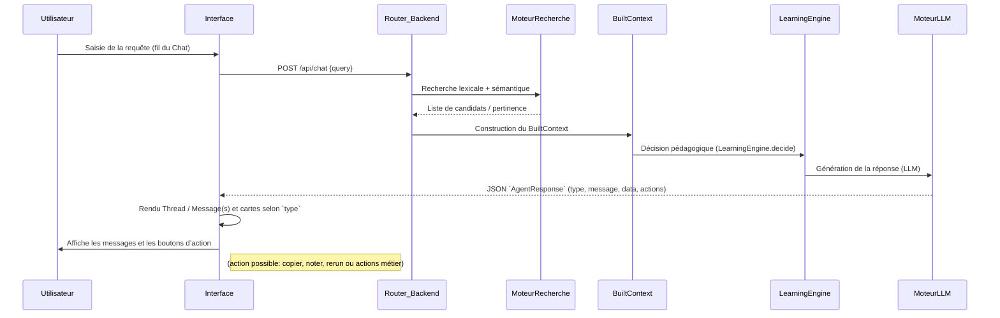

# Résumé exécutif

Nous proposons d’intégrer **Assistant UI** en se basant uniquement sur le code frontend, sans toucher au backend existant. L’**AssistantRuntimeProvider** et le transport **AssistantChatTransport** (API `/api/chat`) relient l’interface au backend. Les composants d’Assistant UI (ThreadList, Thread/Chat, Composer, ModelSelector, MessageActions, cards personnalisées) géreront l’affichage et les interactions. Chaque réponse backend (contrat `AgentResponse`) sera transformée en messages/chat dans le **Thread** : le champ `message` s’affichera comme texte, le champ `type` déterminera quel composant (ExerciseCard, QuizCard, etc.) utiliser, et `actions` sera rendu sous forme de boutons (via `<ActionBarPrimitive>` ou UI custom). Les autres contrats (RoutingResult, SearchResponse, BuiltContext) restent internes au backend. 

La bibliothèque Assistant UI fournit des **compétences/skills** et primitives pour guider le développement. Par exemple, la commande `/assistant-ui` affiche le guide général, `/thread-list` la doc sur la gestion multi-conversation, etc. On installera les outils via le CLI : `npx assistant-ui@latest init` configure le runtime, et `npx shadcn@latest add "@assistant-ui/elements-<composant>"` ajoute chaque composant requis (par ex. Thread, Composer, ThreadList, ModelSelector).  

Nous détaillons ci-dessous le **mapping** entre contrats backend et primitives UI, la **liste des compétences** d’Assistant UI utiles, l’**architecture d’intégration** (diagrammes de séquence et composant), le **plan d’implémentation** avec jalons, la structure des fichiers frontend, le **plan de tests**, la stratégie de **gestion d’erreurs**, les variables de configuration, l’**observabilité**, l’**accessibilité/i18n**, et le découpage en versions (MVP, v1, v2).

## Cartographie Backend → UI

| Contrat/Champ          | Composant UI (primitive)      | Description / Règle de transformation                         |
|------------------------|-------------------------------|-------------------------------------------------------------|
| **AgentResponse.type** | – (logique de présentation)   | Détermine quel composant “card” utiliser :  
`exercise`→ExerciseCard, `quiz`→QuizCard, `hint`→HintCard, etc. (voir ci-dessous). |
| **AgentResponse.message**  | Message du Thread (Assistant) | Affiché comme texte dans le chat. Peut contenir markdown et images.   |
| **AgentResponse.actions**  | ActionBar ou boutons custom | Liste d’actions proposées (boutons). On peut utiliser `<ActionBarPrimitive>` ou un composant maison pour les rendre interactifs. Exemple : validation d’un exercice. |
| **AgentResponse.data**     | Exercices/quiz/… (cards)     | Données métier (questions, options, code, feedback, etc.) alimentant les composants spécialisés (ExerciseCard, QuizCard, EvaluationCard, HintCard, CodeActivityCard). Par exemple, `message="Traduire : ...", data.choices` → QuizCard. |
| **RoutingResult.subject,topic,confidence** | – (interne)    | Utile pour le backend (flux du router) mais **non affiché** directement. Un statut “ambiguous/unsupported” pourrait déclencher un message générique, mais en UI on se concentre sur `AgentResponse`. |
| **SearchResponse.results** | – (interne)                 | Résultats de recherche de connaissances, utilisés en fallback dans le backend. Non exposé au frontend. |
| **BuiltContext (complet)** | – (interne)                  | Contexte métier passé au moteur d’apprentissage. **Pas utilisé** dans l’UI (le moteur gère l’interface). L’UI ne connaît que l’AgentResponse résultant. |

Cette séparation claire assure que l’UI se contente d’afficher les réponses structurées du backend. Toute logique de routage ou de fallback reste invisible dans l’interface, sauf à travers les messages/cards retournés.

## Compétences et outils d’Assistant UI

Assistant UI propose des **“skills” CLI** (documentation interactive) pour faciliter le travail :

| Commande `/…`        | Usage (documentation interactive)                         |
|----------------------|---------------------------------------------------------|
| `/assistant-ui`      | Guide général d’architecture et vue d’ensemble. |
| `/setup`             | Configuration du projet (AI SDK, LangGraph, backends). |
| `/primitives`        | Documentation des composants UI de base (Thread, Composer, Message…). |
| `/runtime`           | Guide du runtime et gestion d’état (AssistantRuntime). |
| `/tools`             | Enregistrement de tools IA et UI correspondante. |
| `/thread-list`       | Gestion des conversations multiples (ThreadList). |
| `/update`            | Mise à jour des librairies Assistant UI et AI SDK. |

Ces “skills” (activables avec `npx skills add assistant-ui/skills`) permettent d’obtenir rapidement l’aide contextuelle depuis un éditeur intelligent (Claude Code). 

En plus, le CLI **assistant-ui** et le CLI **shadcn** s’utilisent pour installer et configurer le front-end. Par exemple, après `npx assistant-ui@latest init` (pour initialiser le runtime) on installe les composants UI : 
```bash
npx shadcn@latest add "@assistant-ui/elements-thread"        # Composant Thread (chat)
npx shadcn@latest add "@assistant-ui/elements-thread-list"   # Composant ThreadList
npx shadcn@latest add "@assistant-ui/elements-composer"      # Composant Composer (saisie)
npx shadcn@latest add "@assistant-ui/elements-model-selector" # Composant ModelSelector
npx shadcn@latest add "@assistant-ui/elements-message-actions" # MessageActions (barre d’actions)
```
Ces commandes ajoutent le code React correspondant dans `frontend/components/assistant-ui/elements`. Par exemple, après le premier, on peut utiliser `<Thread />` dans le code. Les docs officielles montrent comment chaque composant s’installe et s’utilise (par ex. Thread, Composer, ModelSelector). L’utilisation d’un runtime (`AssistantRuntimeProvider`) est conseillée pour que tous ces composants soient “connectés” ensemble via le même état global.

## Architecture d’intégration

L’architecture reste client/serveur : l’UI envoie chaque requête utilisateur au backend via l’API, et affiche les réponses structurées.  

**Diagramme de séquence (flux utilisateur ➜ backend ➜ UI)** :



Chaque étape se déroule selon l’architecture existante (Router – Retrieval – Fallback – BuiltContext – Learning – Agents – outils). L’ajout d’Assistant UI n’introduit pas de nouvelle couche back-end : il remplace uniquement la « couche présentation ». Par exemple, l’appel `AssistantChatTransport({api:"/api/chat"})` créé la liaison vers notre route API. 

**Diagramme de composants (organisation des éléments UI)** :

```mermaid
flowchart LR
    Utilisateur([Utilisateur]) -->|interaction| ThreadList[ThreadList<br>(panneau de fils)]
    ThreadList --> Thread[Thread<br>(chat principal)]
    Thread --> Composer[Composer<br>(barre de saisie)]
    Thread --> ModelSelector[ModelSelector<br>(sélecteur de modèle)]
    Thread --> Messages[Messages]
    Messages --> MessageActions[MessageActions<br>(barre d'actions)]
    Messages --> Cards[Cartes personnalisées]
    Cards --> ExerciseCard[ExerciseCard]
    Cards --> QuizCard[QuizCard]
    Cards --> EvaluationCard[EvaluationCard]
    Cards --> HintCard[HintCard]
    Cards --> CodeCard[CodeActivityCard]
```

Ce diagramme montre que **ThreadList** permet de changer de conversation, **Thread** est la zone de chat (liste de messages + Composer + sélecteur de modèle + actions), et qu’au sein de Thread les réponses du système sont rendues soit comme messages assistant, soit comme des « cartes » spécifiques (exercice, quiz, etc.), selon `AgentResponse.type`. Par exemple, si l’agent retourne `{type:"quiz", ...}`, on utilise `<QuizCard>` pour afficher la question et les choix. Les **MessageActions** (ex. copier, noter, regénérer) peuvent être affichées via `<ActionBarPrimitive>`. Le composant **Composer** gère la saisie utilisateur (texte, pièces jointes, botton send/stop). Le **ModelSelector** (pop-over) permet de changer de modèle AI, utilisant la même `AssistantChatTransport` sous-jacente. 

Toutes les interactions (envoi de message, clic sur un bouton d’action, sélection de modèle, etc.) transitent par le **AssistantRuntimeProvider**. Ce runtime unifie les états (fils de conversation, messages, etc.) via l’**Assistant Chat SDK**. 

## Plan d’implémentation

1. **Initialisation du projet** – Ajouter le runtime et Installer les composants :
   - Exécuter `npx assistant-ui@latest init` pour configurer le runtime (Provider) avec notre transport vers `/api/chat`.
   - Ajouter les composants nécessaires via `shadcn`: Thread, ThreadList, Composer, ModelSelector, MessageActions. Vérifier qu’ils se compilent sans erreurs.
   - S’assurer que l’application enveloppe les vues dans `<AssistantRuntimeProvider>`.
2. **Développement de l’interface chat basique** – Envoyer/afficher des messages :
   - Implémenter `<Thread />` avec `<Composer />` comme interface de chat (voir exemple de base).
   - Configurer `<AssistantChatTransport>` pour qu’au clic “Envoyer”, la requête atteigne `/api/chat` backend.
   - Gérer la réponse JSON (`AgentResponse`) : afficher le `message` dans le chat. Si `type=null` ou non pris en charge, se contenter d’un message assistant standard.
   - Afficher les `actions` retournées par l’agent comme boutons (via `<ActionBarPrimitive>` ou un composant maison). Par ex. un bouton « Ok » ou « Continuer ».
3. **Integration de ThreadList et sélection de conversation** – Multi-fils :
   - Ajouter le composant `<ThreadList />` dans la barre latérale. Il gère par runtime la création, sélection et renommage des threads.
   - S’assurer que chaque nouveau thread correspond à un nouvel objet “conversation” côté client, en appelant par exemple l’API pour initialiser un état ou simplement effacer l’historique local.
4. **Modèles et contexte de thread** :
   - Intégrer `<ModelSelector />` pour permettre à l’utilisateur de changer de modèle si l’API le supporte. Installer avec `npx shadcn add "@assistant-ui/elements-model-selector"`.
   - Veiller à ce que le sélecteur mette à jour l’état du runtime (par `useAuiState` par ex.) afin que le prochain message soit envoyé avec le bon modèle.
5. **Composants métiers (Cards)** :
   - Créer les composants spécifiques (ExerciseCard, QuizCard, EvaluationCard, HintCard, CodeActivityCard). Ils prendront en props les données de `AgentResponse.data`.
   - Dans le code React, faire un switch sur `response.type` pour décider quel composant renvoyer dans la vue du message assistant.
   - S’inspirer du fonctionnement des composants built-in : par exemple, les cartes contiendront leurs propres boutons d’action ou formulaires.  
6. **Logiciel des actions dans le chat** :
   - Utiliser `MessageActions` (ActionBar) pour les actions générales (copier, notations). Pour actions métier (p.ex. “Vérifier réponse”), utiliser le **Context API** d’Assistant UI ou un callback personnalisé. On peut ajouter un bouton avec `onClick={() => submitMessage(actionValue)}` en utilisant `useChatRuntime` ou `useAui()`.
7. **Gestion des erreurs et fallback** :
   - Prévoir l’affichage d’un message d’erreur user-friendly si le backend ne répond pas (p.ex. “Serveur non disponible, réessayez”). 
   - Si le JSON de l’agent est invalide ou qu’un type inconnu arrive, afficher un message générique et logguer l’erreur (ne pas bloquer l’UI). 
   - Cibler également les cas où `actions` ou `data` manquent : par défaut, cacher la partie action ou afficher un état vide.  
8. **Intégration et tests** – Validation de bout en bout :
   - Mettre en place une suite de tests pour vérifier l’UI : tests unitaires pour chaque composant, tests d’intégration simulant des appels API. 
   - Vérifier que l’enchaînement complet (saisie utilisateur, API, affichage du contenu) fonctionne correctement. 
   - S’assurer que la **régression** est nulle (aucune régression sur les 277 tests existants backend) et que l’on passe les nouveaux tests UI.
9. **Itération et amélioration UI** – Améliorer l’UX :
   - Ajouter les actions avancées : notes utilisateurs sur les réponses, rechargement, copier (via `ActionBarPrimitive`). 
   - Styliser les cartes et le chat avec le thème existant (p. ex. Tailwind déjà en place).
   - Valider l’affichage du coût lexical/sémantique dans un coin (utile en dev, pas visible à l’étudiant). 
10. **Documentation et formation** – Reporter dans le rapport final :
    - Documenter chaque composant créé, commenter les transformations spécifiques (ex. comment `AgentResponse.data` alimente le contenu des cartes). 
    - Rédiger les flux (diagrammes ci-dessus, explications) pour que le workflow soit clair.

Chaque tâche correspond à un jalon concret (initialisation, chat basique, multi-thread, etc.). À chaque étape, on vérifie l’avancement avec des tests simples (checks API, rendu de composants, etc.). La progression pourra être mesurée par l’implémentation complète de la chaîne `Utilisateur→API→UI` et l’ajout incrémental des fonctionnalités listées.

## Structure des fichiers Frontend

| Fichier / Dossier                           | Rôle / Contenu principal                                                |
|---------------------------------------------|-------------------------------------------------------------------------|
| `frontend/components/assistant-ui/elements` | Contiendra les éléments Assistant UI (Thread.aui.tsx, Composer.aui.tsx, etc.). Installés par `shadcn` (voir sections précédentes). |
| `frontend/components/assistant-ui/ThreadAU_I/` (exemple) | Éventuel override de slots dans `<Thread>`, `<Composer>`, etc., pour injecter nos composants métier (par ex. ToolFallback, etc.). |
| `frontend/components/ExerciseCard.tsx`      | Composant pour affichage des exercices (questions, réponse(s), validation). |
| `frontend/components/QuizCard.tsx`          | Composant pour quiz (question + choix).                                   |
| `frontend/components/EvaluationCard.tsx`    | Composant pour évaluation de code / exercice (affichage d’un code, critique, etc.). |
| `frontend/components/HintCard.tsx`          | Composant pour indice (texte explicatif).                                |
| `frontend/components/CodeActivityCard.tsx`  | Composant pour exercice de code interactif (éditeur, test).              |
| `frontend/components/MessageActions.tsx`    | Barre d’actions attachée à chaque message assistant (copier, thumbs, regen). |
| `frontend/components/ThreadListSidebar.tsx` | Sidebar contenant `<ThreadList>` et un bouton “Nouveau fil”.             |
| `frontend/pages/chat.tsx` (ou équivalent)   | Page principale du chat, intègre `<AssistantRuntimeProvider>` et `<Thread>`.  |
| `frontend/lib/assistantConfig.ts`           | Configuration possible (liste de modèles, clés API, etc.).               |

Chaque composant aura ses propres tests unitaires (voir section tests). Les composants Assistant UI doivent rester importés de `@assistant-ui/react` ou dans notre dossier `assistant-ui/elements` généré, pour bénéficier des mises à jour (voir skill `/update`).

## Plan de tests

Nous définissons au moins **15 cas de test** variés, répartis en tests unitaires, intégration et end-to-end (E2E) :

| Cas de test                                                       | Type          | Description                                                                                                                                                                     |
|-------------------------------------------------------------------|---------------|---------------------------------------------------------------------------------------------------------------------------------------------------------------------------------|
| **T1** : Affichage d’un message simple (lexical)**              | Intégration   | Envoyer “Hello” → Backend renvoie `type:null, message:"Hello"` → Vérifier que le texte s’affiche correctement dans `<Thread>`.                                                  |
| **T2** : Exercice à trou (semantic)**                            | Intégration   | Envoyer une question sur un sujet (p.ex. boucles) → Backend retourne `{type:"exercise", message:"Exercice ...", data:{...}}` → L’ExerciseCard s’affiche avec la consigne.       |
| **T3** : Quiz (synonyme)**                                       | Intégration   | Envoyer une phrase portant sur un concept → Backend renvoie `{type:"quiz", ...}` → QuizCard affiche la question et les choix, et valide la sélection correcte.                 |
| **T4** : Indice (description conceptuelle)**                     | Intégration   | Phrase complexe (“fonction s’appelle elle-même”) → Backend donne `type:"hint"` → HintCard apparaît, s’assurant que le texte explicatif est bien visible.                        |
| **T5** : Message de l’assistant (lexical exact)**                | Unitaire      | Test unitaire du cas “return” où `AgentResponse.type=null` → le message s’affiche tel quel.                                                                                        |
| **T6** : Actions de message indisponibles**                      | Unitaire      | Réponse agent sans champ `actions` → vérifier que l’UI n’affiche pas de barre d’actions (ActionBar) ou qu’elle reste masquée.                                                  |
| **T7** : Action d’utilisateur (outil)**                           | E2E           | L’assistant propose un bouton (ex: “Valider”) → L’utilisateur clique → Vérifier qu’une nouvelle requête est envoyée au backend (via l’AssistantChatTransport) et que l’UI s’actualise. |
| **T8** : Timeout / backend indisponible**                         | Intégration   | Simuler échec de l’API (503) → Vérifier affichage d’un message d’erreur friendly (“Serveur indisponible”).                                                                        |
| **T9** : Message inconnu (fallback)**                            | Intégration   | Envoyer requête incompréhensible → Backend renvoie `status:"unknown"` ou message générique → L’UI affiche “Je ne comprends pas…” (Fallback normal).                               |
| **T10** : Multi-conversation (fil)**                             | Intégration   | Créer plusieurs threads (via ThreadList) et alterner : chaque fil conserve son historique propre.                                                                                 |
| **T11** : Sélecteur de modèle**                                  | Unitaire      | Ouvrir le modèle courant, changer de modèle via ModelSelector, vérifier que le nouvel appel API utilise bien la nouvelle valeur (mock).                                         |
| **T12** : Boutons de message (copier/regenerate)**              | Intégration   | Vérifier que les boutons “Copier”, “Recommencer” apparaissent et fonctionnent (p.ex. copie du texte dans le presse-papier).                                                     |
| **T13** : Accessibilité (keyboard)**                             | UX / E2E      | Naviguer au clavier : tabuler dans ThreadList, Composer, boutons d’actions. Les éléments doivent être focusables (attribut `aria-label` sur les boutons).                        |
| **T14** : Internationalisation (FR vs EN)**                     | UX           | Changer la langue de l’interface (ex. loader ou config i18n) et vérifier que tous les labels et placeholders (ex: “Envoyer”, “Nouveau fil”) sont traduits en français ou anglais. |
| **T15** : Tests de performance de base**                         | Intégration   | Envoyer plusieurs messages en file (simulation) et mesurer que le chat reste fluide et que l’UI ne freeze pas (vérifier absence d’erreur de mémoire).                            |
| **T16** : Régression existante**                                | E2E           | Lancer la suite de tests existants (277/277) pour s’assurer qu’aucune fonctionnalité du backend n’a cassé pendant l’intégration du front.                                         |

Chaque test aura une assertion claire : par exemple, présence d’un élément `<div>` avec le texte attendu, activation de bouton, etc. Les tests UX (E2E) peuvent utiliser des outils comme Cypress ou Playwright pour simuler l’interaction. Les tests unitaires couvriront les composants React (snapshot ou texte rendu). La table ci-dessus utilise au moins 15 cas, dont des cas adversariaux (erreur backend, actions manquantes, etc.).

## Gestion des erreurs et de secours

- **Backend offline / erreur réseau :** Afficher une alerte utilisateur du type « Serveur indisponible, veuillez réessayer plus tard ». Refaire automatiquement un nouvel essai est optionnel, mais ne pas bloquer l’UI. Log interne de l’erreur (console ou service) pour analyse.
- **Données manquantes dans AgentResponse :** Par exemple si `type` ou `data` est absent, utiliser un comportement par défaut (afficher le message brut dans le chat). En cas d’`actions` vide, masquer la barre d’action.
- **Type de réponse inconnu :** Si `type` n’est pas reconnu, traiter la réponse comme simple texte assistant (éviter les exceptions). Enregistrement d’un warning en log pour ces cas.
- **Échecs dans l’UI :** Surround les parties critiques de rendu (cards, ActionBar, etc.) avec des blocs try/catch ou des boundarys React pour ne pas faire crasher l’application. Afficher un message générique (« Une erreur est survenue ») si un composant ne peut se monter.
- **Fallback métier :** Si l’assistant retourne un statut “ambiguous” ou “unsupported”, proposer un prompt clair (« Désolé, je ne peux pas répondre à cette demande pour l’instant. ») et peut-être inviter à préciser la question.
  
Le but est de toujours donner un retour utilisateur cohérent et éviter tout crash frontal. Tout incident est consigné en log (voir Observabilité) pour être corrigé ensuite.

## Configuration et variables d’environnement

- **API endpoint :** Si besoin de paramétrage, prévoir une variable (ex. `REACT_APP_CHAT_API_URL`) pour l’URL du transport AssistantChat. Par défaut `/api/chat`.
- **Modèles disponibles :** Liste des modèles AI pour le **ModelSelector**. Par exemple dans `assistantConfig.ts` : 
  ```ts
  export const MODELS = [{name:"GPT-4", provider:"openai"}, {name:"Claude 3", provider:"anthropic"}, ...];
  ```
  On peut stocker cette config en JSON ou en fichier TS. 
- **Clés d’API (optionnel) :** Si des composants UI nécessitent une clef (ex. un widget 3rd-party), mettre les clés en variables d’env (ex. `REACT_APP_MAPBOX_TOKEN` pour embed Google Maps).
- **Feature flags :** Prévoir un drapeau (ex. `REACT_APP_ENABLE_O11Y=true/false`) pour activer l’observabilité ou des plugins (comme si on active le suivi analytique).
- **Langue :** Si l’UI prend en charge plusieurs langues, indiquer la locale par défaut (ex. `REACT_APP_LOCALE=fr`).
  
Toutes les variables de configuration doivent être déclarées dans `.env` et documentées (ex. `.env.example`). L’utilisation des clés et flags doit être centralisée, par exemple dans un module de configuration.

## Observabilité et télémétrie

Pour surveiller l’usage et le comportement de l’UI, on proposera de logger les événements majeurs et quelques métriques :

- **Événements utilisateurs** : 
  - `thread_created` (nouveau fil créé), `message_sent` (message utilisateur envoyé), `response_received` (AgentResponse reçu), `action_clicked` (utilisateur clique un bouton de l’agent). 
  - Chaque event inclut : user_id (si disponible), thread_id, timestamp, type de message (`"exercise"`, etc.).
- **Actions de l’UI** : Réussites d’opérations (copie texte, note) et erreurs sont également loggés.
- **Erreurs et exceptions** : Catch global (ou boundary React) pour remonter les exceptions front, avec stacktrace et données du thread.
- **Métriques de performance** : Temps de réponse de l’API (latence), temps de rendu du chat (utiliser un timer autour de l’affichage). Assistant UI expose des événements de performance via `react-o11y` qui peuvent être activés pour instrumenter le load time des composants.
- **Traces (optionnel)** : Instrumenter les chemins critiques (ex. rendu du Thread au complet) via un outil de tracing JS (p.ex. OpenTelemetry).
  
Par défaut, on peut envoyer ces logs au console du navigateur pour développement. En production, les intégrer à un backend de logs (p. ex. Sentry, Datadog). Les librairies Assistant UI supportent un contexte `AuiO11yContext` pour enrichir les logs de scope utile (scope `thread`, `message`, etc. selon le component). 

## Accessibilité (a11y) et i18n

- **Accessibilité (WCAG) :** Les primitives Thread/Composer ont **« accessibility built-in »** (ex. navigation clavier, ARIA roles). Nous devons veiller à :
  - Donner des `aria-label` explicites aux boutons d’action. Par exemple `<ComposerPrimitive.Send aria-label="Envoyer le message" />`.
  - Respecter les contrastes de couleurs pour le texte et les boutons (utiliser le thème existant).
  - Tester la navigation au clavier : tabulation pour changer de fil, composer, sélectionner un bouton, etc.
  - Tout contenu dynamique (cartes, messages) doit rester lisible par un lecteur d’écran (pas d’éléments non sémantiques masquant l’information).
- **Internationalisation (i18n) :** L’interface doit supporter au moins français et anglais. Actions à prendre :
  - Placer les textes statiques (ex. “Nouveau fil”, “Envoyer”) dans des fichiers de traduction. AUI utilise l’anglais par défaut ; nous devons remplacer les labels par des traductions. 
  - Prévoir un mécanisme simple (contexte React ou hook) pour changer la locale (p. ex. `<Thread locale="fr" />` si disponible, sinon wrapper maison).
  - Vérifier que les composants comme ModelSelector gèrent la traduction des éléments (sinon adapter ou cacher).
  - Traduire les messages d’erreur (erreur réseau, fallback “Je ne comprends pas…”).
  - Tester UX en français : tous les composants generics doivent afficher “fr” par défaut ou le texte fourni. 
- **Mobile / Responsive :** Assurer que l’interface (Thread, Composer, ThreadList) est responsive. Par exemple, utiliser `<ThreadListSidebar>` pour cacher/afficher le panneau de threads sur petit écran.

## Priorisation et déploiement progressif

Nous proposerons un déploiement par versions :

- **MVP (version initiale) :** Chat texte de base. ThreadList, Composer, et affichage d’un message assistant simple (sans cartes). Envoi de requête → affichage de réponse. Bouton “Nouveau fil” crée un chat vierge. Tests de connectivité. (Livrable minimal utilisable).
- **v1 :** Ajout des features principales :
  - Cartes métiers (ExerciseCard, QuizCard, etc.) fonctionnelles pour au moins deux types.  
  - Affichage des actions sur les messages et leur fonctionnement (bouton valider, etc.).  
  - Sélecteur de modèle intégré.  
  - Tests automatisés de bout en bout (cas T1–T10).  
  - Gestion basique des erreurs (T8–T9).
- **v2 :** Améliorations avancées :
  - Compléter toutes les cartes métier (tous les types prévus).  
  - Compléter le plan de tests UX (accessibilité, i18n T13–T14).  
  - Ajout de l’observabilité : logs événementiels et métriques dans la prod.  
  - Optimisations UI (performances, animations du Thread, etc.).  
  - Stratégies de fallback complexes (p.ex. historique conversationnel, suggestions post-réponse).
  
Chaque version inclut les tests requis pour sa fonctionnalité. Le déploiement pourra se faire en phasé (feature flags), en commençant par un environnement de test interne avant mise en production. L’utilisateur final (étudiant) doit toujours voir une interface cohérente : le MVP est très simple, les versions ultérieures ajoutant de la valeur pédagogique sans interrompre le service.

**Sources et références :** Nous nous appuierons sur la documentation officielle d’Assistant UI pour la plupart des éléments d’implémentation, ainsi que sur les exemples de composants (Thread, Composer, ModelSelector) fournis dans les guides. Le mapping backend–frontend est défini ici pour assurer la cohérence et la robustesse du système sans modifier les contrats existants du backend. Des tests de régression complets (277/277) seront exécutés pour garantir qu’aucune fonctionnalité métier n’est affectée. Chaque étape du plan sera validée par des tests unitaires et fonctionnels avant d’avancer.