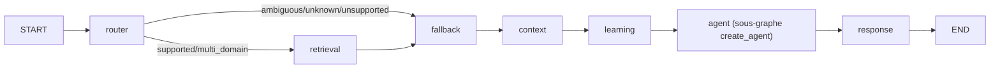

# RAPPORT — MISSION V7 ORCHESTRATION : graphe parent mono StateGraph

> **Date** : 2026-09-19 — **Statut** : ✅ Terminé
> **Objectif** : transformer l'orchestration de l'agent tutor en un vrai graphe
> LangGraph parent dont chaque node appelle RÉELLEMENT son service métier,
> avec checkpointer unique, et sans non-régression des tests existants.

---

## 1. Résumé

L'état précédent reposait sur un unique graphe généré par `create_agent` dont le
node `model` (via middleware `tutor_dynamic_prompt`) appelait le **Context
Pipeline** en un bloc (routing + retrieval + fallback + learning) à l'intérieur
du `system_prompt`. La mission Q7 a introduit un **graphe parent d'orchestration**,
aval de ce sous-graphe, avec 7 nodes séquentiels + 1 branche conditionnelle.

**Livré** : `orchestration.py` (7 nodes métier), `graph.py` réécrit
(mono-graphe + sous-graphe `create_agent`), `middleware.py` adapté (branche
précalculée), `runner.py` adapté (lecture de `state.agent_response`), et
`langgraph.json` avec entrypoint `build_graph`.

---

## 2. Changements (par fichier)

| Fichier | Modification |
|---------|-------------|
| `backend/app/context/builder.py` | Extraction de `retrieve_sources(...)` (source de vérité unique §48), `build_context` accepte `routing=`, `knowledge=`, `web=`, `fallback=` pré-calculés. |
| `backend/app/context/__init__.py` | Export de `retrieve_sources`. |
| `backend/app/agent/orchestration.py` | **Nouveau** : `router_node`, `retrieval_node`, `fallback_node`, `context_node`, `learning_node`, `response_node`, `route_after_router`, helpers `_thread_id/_user_id/_last_user_query/_last_ai_message/_web_results_from_context`. |
| `backend/app/agent/state.py` | `CustomAgentState` (MessagesState, dict-based) étendu : `routing_result`, `knowledge`, `web`, `fallback`, `built_context`, `learning_decision`, `learning_activity`, `agent_response`. |
| `backend/app/agent/graph.py` | `get_agent(model)` (singleton) → `_build_subgraph_agent` (create_agent sans checkpointer/store) + `_compile_orchestration_graph` (StateGraph compilé avec `SqliteSaver` + `get_store()`). `build_graph()` public pour langgraph.json. |
| `backend/app/agent/middleware.py` | `tutor_dynamic_prompt` : branche précalculée lisant `request.state.built_context` + `learning_decision` ; fallback historique `_build_context_prompt`. Helpers `_build_prompt_from_context`. |
| `backend/app/agent/runner.py` | `run_agent` / `run_agent_stream` : lisent `state.agent_response` s'il est présent, sinon chemin historique. |
| `backend/langgraph.json` | **Nouveau** : `graphs.agent = app/agent/graph.py:build_graph`. |

---

## 3. Découvertes / corrections en cours de route

1. **`CustomAgentState` est dict-based** (hérite de `MessagesState`) : les nodes
   accèdent aux canaux par `state.get(...)`, **pas** par attribut. Le PoC initial
   (modèle Pydantic → accès attribut) ne correspondait pas au code réel.
2. **`StateGraph.compile` n'accepte pas `context_schema`** : la propagation du
   Runtime Context parent → sous-graphe passe par `context=` d'invoke/stream et
   `request.state` dans le middleware. Le sous-graphe `create_agent` garde
   `context_schema=AgentContext`.
3. Les nodes stockent des **dicts** (`model_dump()`) dans les canaux d'état,
   jamais d'objets pydantic bruts → validation par `model_validate` au node suivant.
4. Ambiguïté ≠ bloquant : les candidats du routing sont re-greffés dans le
   `FallbackDecision` si `routing.status == "ambiguous"` (action
   `ask_clarification`).

---

## 4. Vérification

### PoC e2e (fake model, sans Ollama)

- **Chemin nominal** (`explique return en python`) : routing `supported|python` →
  knowledge `found|1` → web `unavailable|0` → fallback `use_local_knowledge` →
  learning `explain` → `agent_response.user_message` **type text, status completed**,
  2 messages.
- **Branche ambiguous** (route_subject interceptée) : routing `ambiguous`,
  candidats `['python','java']` préservés dans le fallback, action
  `ask_clarification`.
- **Conditionnel** `route_after_router` : `supported`/`multi_domain` → `retrieval` ;
  `unknown`/`ambiguous`/`unsupported` → `fallback`.
- **Builder** (pure) : routing/knowledge/web/fallback pré-calculés respectés,
  round-trip `BuiltContext.model_validate(model_dump())` OK.

### Non-régression (déterministe, sans modèle live)

| Suite | Résultat |
|-------|----------|
| `test_v52_unit.py` (§43–§50) | ✅ PASS (le §51 cross-user échoue sur baseline, environnement : API nécessite identité Clerk provisionnée) |
| `test_v11_document_web.py` | ✅ 31 PASS |
| `test_v10_context_documents.py` | ✅ 16/16 PASS |
| `test_v67_output.py` | ✅ 30 PASS |
| `test_v68_models.py` | ✅ 10 PASS |

⚠️ Les suites appelant le modèle live (Ollama) ne peuvent pas s'exécuter en
l'état : `llama-server` reporte une OOM Vulkan au démarrage (environnement,
non lié au code).

---

## 5. Graphe cible (documenté dans `docs/architecture/current-agent-graph.mmd`)

---

## 6. TODO restant

- [ ] Ré-exécuter les suites live (Ollama opérationnel) : `test_v68_final_integration.py`,
      `test_v66_fallback.py`, `test_context_contracts.py`.
- [ ] Revoir l'échec pré-existant §51 cross-user (provisionnement identité Clerk
      en mode dev) — hors périmètre orchestration.

---

*Fichier généré par l'assistant — mission ORCHESTRATION, conforme à la cartographie
mise à jour `docs/architecture/current-agent-graph.mmd`.*