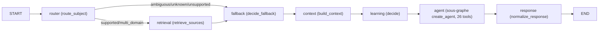

# RAPPORT DE PROJET — Agent Tutor (Agent Control Center)

> **Date** : 2026-09-19
> **Stack** : Python LangGraph + Ollama + FastAPI + React (Vite/TS/Tailwind 4)
> **Statut global** : ✅ fonctionnel — évolution continue par missions Vn

---

## 1. Vision du projet

Agent pédagogique conversationnel (« Agent Tutor ») avec supervision complète
(`Agent Control Center`) : un backend d'orchestration LangGraph multi-vision
(routing, RAG, mémoire, pédagogie), une identité Clerk, et un frontend React
d'espace utilisateur (chat + mémoires + documents + logs).

---

## 2. Architecture

```
React (Vite / TS / Tailwind 4 / Clerk / assistant-ui / Framer Motion)  → :5173
 │  /chat  /documents  /memory  /logs  + SSE /api/events
 ▼
FastAPI                                                                 → :8000
 │  auth Clerk (JWT JWKS) · users · threads · chat · chat/stream ·
 │  state · history · logs · health · documents · WS /ws/logs
 ▼
LangGraph — graphe parent ORCHESTRATION (StateGraph) + sous-graphe create_agent
 │  router → retrieval → fallback → context → learning → agent → response
 ▼
SQLite (SqliteSaver + SqliteStore + RagStore)
 ├─ checkpoints.db   → state LangGraph (messages, activités, orchestration)
 ├─ app.db           → users + threads
 ├─ long_term_memory.db → profil + MemoryFacts (mémoire sémantique)
 └─ user_documents.db → RAG documents utilisateurs
Logs JSON-lines → logs/agent.log
Ollama (local ou cloud) → MODEL_OLLAMA dans .env
```

### Graphe d'orchestration (V7, mission ORCHESTRATION)



Architecture réelle documentée : `docs/architecture/current-agent-graph.mmd`.

---

## 3. Backend — services

| Module | Rôle |
|--------|------|
| `app/agent/graph.py` | Mono-graphe parent (orchestration) + sous-graphe `create_agent` ; `get_agent` singleton ; `build_graph()` public (entrypoint langgraph.json). |
| `app/agent/orchestration.py` | 7 nodes métier : router, retrieval, fallback, context, learning, agent, response. |
| `app/agent/middleware.py` | Observabilité (`wrap_tool_call`) + `tutor_dynamic_prompt` (branche précalculée lit `state.built_context`, repli historique). |
| `app/agent/runner.py` | `run_agent` / `run_agent_stream` — lit `state.agent_response` (sinon chemin historique). |
| `app/agent/state.py` | `CustomAgentState` (MessagesState dict-based) + canaux orchestration. |
| `app/context/` | Router, retrieval, builder (`build_context` + `retrieve_sources` extrait), web_search, prompt_builder, model_capabilities, budget V6.8. |
| `app/rag/` | `RagStore` + `DocumentRetriever` (documents utilisateurs, isolation user_id, fail-safe). |
| `app/learning/` | `decide()` — décision pédagogique déterministe (V6). |
| `app/fallback/` | `decide_fallback()` — stratégies de repli (RAG/web/tuteur général/clarification). |
| `app/agent/tools.py` | 26 tools : recherche web, 7 memory, 7 pédagogiques, 4 learning profile, 4 code, 4 documents. |
| `app/subjects/` | Registry (18 matières), taxonomy, tool_registry. |
| `app/auth/` | Clerk (JWT JWKS, leeway 60 s) ou mode dev `dev:<name>`. |
| `app/api/` | Routes REST + SSE + WebSocket. |

---

## 4. Frontend

React 19 + Vite 8 + TypeScript 6 + Tailwind 4 + assistant-ui 0.15
+ Clerk + shadcn + Framer Motion + Zustand. Pages : Chat (assistant-ui),
Documents, Memory, Logs + gestion threads/identité.

---

## 5. Historique des missions

| Mission | Contenu | Livrable/état |
|---------|---------|---------------|
| V1–V4 | Dashboard Control Center (chat/tools/memory/logs) | README initial |
| V5 | Runtime Context + dynamic_prompt + intégration serveur | `runner.py`, `middleware.py` |
| V5.2 | Tools pédagogiques (§43–§52) : exercice, compréhension, hint progressif, quiz, code, persistance | `test_v52_unit.py` |
| V6 | Engine d'apprentissage déterministe + fallback | `app/learning`, `app/fallback` |
| V6.8 | Budget de contexte (sections droppables) | `builder.py:513` |
| V7 | **ORCHESTRATION** : graphe parent mono StateGraph, nodes métier réels | `orchestration.py`, `graph.py` |
| V7.1–V8 | Identité Clerk + Frontend Assistant UI (espace utilisateur complet) | `app/auth`, frontend |
| V10 | RAG documents utilisateurs + mémoire sémantique + refactorisation UI | `app/rag`, DocumentsPage |
| V10.1 | Audit/cleanup agent | `RAPPORT-MISSION-V10.1-AUDIT.md` |
| V11 | Documents + web (scraping, provenance, enrichissement) | `RAPPORT-MISSION-V11-DOCUMENTS-WEB.md`, `test_v11_document_web.py` (31 PASS) |

Rapports détaillés : `docs/history/`.

---

## 6. Base de connaissance (18 matières)

actualites · astronomy · automatique_controle · biology · chimie ·
computer_networks · droit_institutions · economie_finance · electronique ·
informatique · intelligence_artificielle · mathematics · mecanique_ingenierie ·
physique · python · robotique_mecatronique · sante ·
sciences_humaines_communication

---

## 7. État des tests (2026-09-19)

| Suite | Résultats |
|-------|-----------|
| V5.2 unitaire (§43–§50) | ✅ pass |
| V10 context documents | ✅ 16/16 |
| V11 documents + web | ✅ 31 PASS |
| V6.7 output | ✅ 30 PASS |
| V6.8 models | ✅ 10 PASS |
| V6.8 final integration / V6.6 fallback / context contracts | ⏸ live-Ollama (serveur OOM au moment du rapport) |

⚠️ Le §51 (cross-user API) échoue en baseline : nécessite identité Clerk
provisionnée (hors périmètre orchestration).

---

## 8. Démarrage

```bash
# Backend (dans backend/)
python -m pip install -r requirements.txt
python -m uvicorn app.main:app --port 8000

# Frontend (dans frontend/)
npm install
npm run dev            # http://localhost:5173

# LangGraph Studio (dans backend/) — nécessite langgraph-cli
& "$env:APPDATA\Python\Python314\Scripts\langgraph.exe" dev   # http://localhost:2024
```

Variables clés : `backend/.env` → `MODEL_OLLAMA`, `OLLAMA_HOST`,
`OLLAMA_API_KEY`, `TAVILY_API_KEY`, `AUTH_MODE`, `CLERK_*`, `ADMIN_CLERK_IDS`,
`LANGGRAPH_CLOUD_API_KEY`.

---

## 9. Points d'attention

- **Ollama local/cloud** : le cloud 31b est lourd ; en cas d'OOM, basculer vers
  un modèle plus léger ou http://localhost:11434.
- **Tests live** : les suites appelant le modèle exigent un serveur Ollama sain.
- **Sécurité** : ne jamais committer `backend/.env` (clés).

---

*Rapport généré par l'assistant le 2026-09-19 — vue consolidée du projet.*